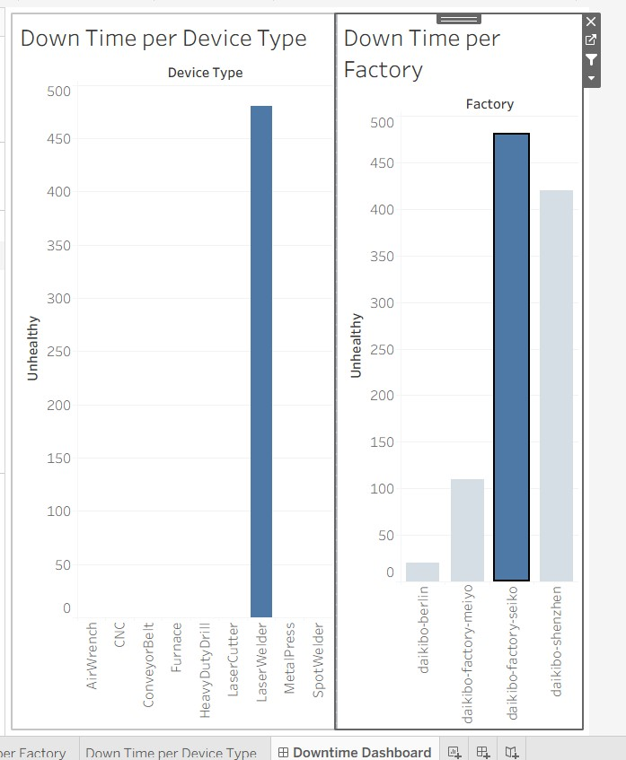

# Machine Downtime Analysis – Tableau Dashboard Task

This is a Tableau-based task I completed as part of the Deloitte Data Analytics Virtual Internship. The goal was to analyse machine statuses, identify downtime trends, and build an interactive dashboard to filter downtime by factory and device type.


## 🔧 Task Overview

We were given a dataset with machine statuses across different factories and device types. The challenge was to:

1. **Create a calculated field** called `Unhealthy` that assigns a value of 10 for each row where the machine status is "Unhealthy". This represented 10 minutes of potential downtime since the last message.
2. Build a **bar chart** to show total downtime per **Factory**.
3. Build another bar chart to show total downtime per **Device Type**.
4. Combine both charts into a **dashboard**, where selecting a factory in the first chart filters the device-level downtime shown in the second chart.
5. Identify the factory with the highest total downtime, click on it to filter the second chart, and take a screenshot of the final dashboard.

## 🔍 Tools Used
1. Tableau Public
2. Calculated Fields
3. Bar Charts and Filtering Logic
4. Interactive Dashboard Design

## 📊 Charts Created

### 1. **Down Time per Factory**
- X-axis: Factory
- Y-axis: Total downtime (based on Unhealthy status)
- Calculated field used:
  ```tableau
  IF [Status] = "Unhealthy" THEN 10 ELSE 0 END

### 2. Down Time per Device Type
•X-axis: Device Type
•Y-axis: Total downtime
•Dynamically filtered based on the selected factory from the first chart.

### 📈 Dashboard
-Combined both charts into a single dashboard.
-Enabled interactivity by using the first chart as a filter.
-Clicking a factory updates the second chart to show only relevant device types and their total downtime.

## Dashboard Image

